# AI-Powered Glove for ASL Translation

> ESP32 + sensor glove + Android app that streams hand-sensor data over Bluetooth and runs on-device ML to translate ASL gestures into text.

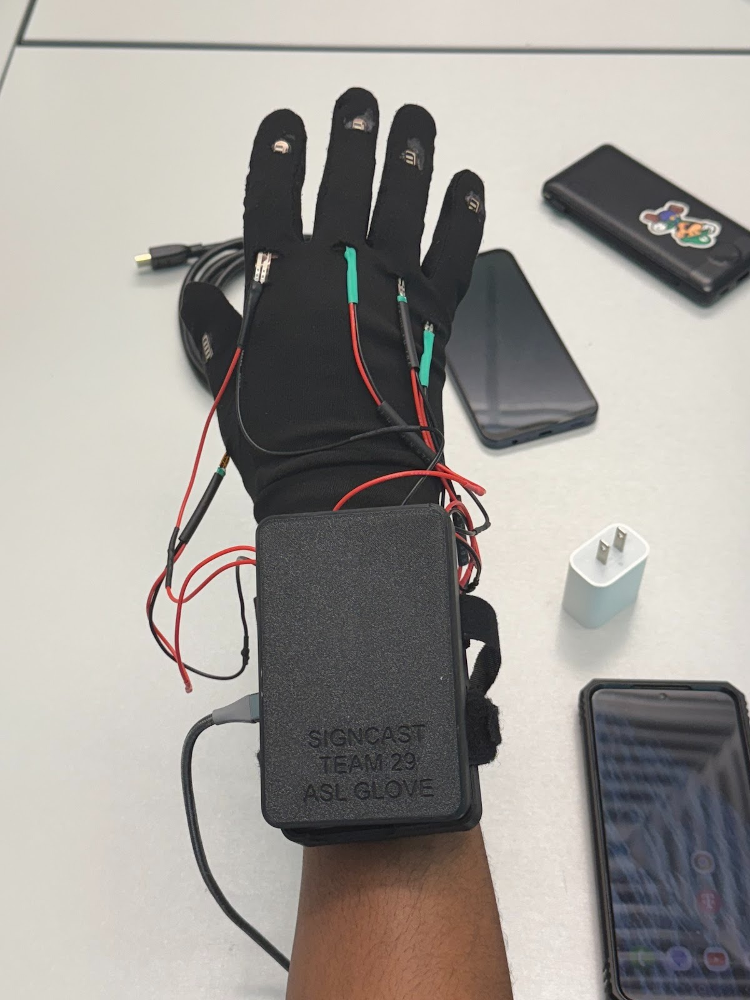

---

## 📋 Quick Links

- 📱 **Android app:** [`android/`](android/)
- 🧠 **Firmware (ESP32):** [`firmware/esp32/`](firmware/esp32/)
- 🧰 **Calibration tools (Python):** [`tools/`](tools/)
- 🧾 **Docs (BLE + setup + calibration):** [`docs/`](docs/)
- 🧩 **Hardware (schematics/PCB):** [`hardware/`](hardware/)

---

## 🎥 Demo

### Video Demonstration
[](https://www.youtube.com/watch?v=YOUR_VIDEO_ID)


### 📸 Project Gallery

#### SignCast Logo & App Interface
<p align="center">
  
</p>
<p align="center">
  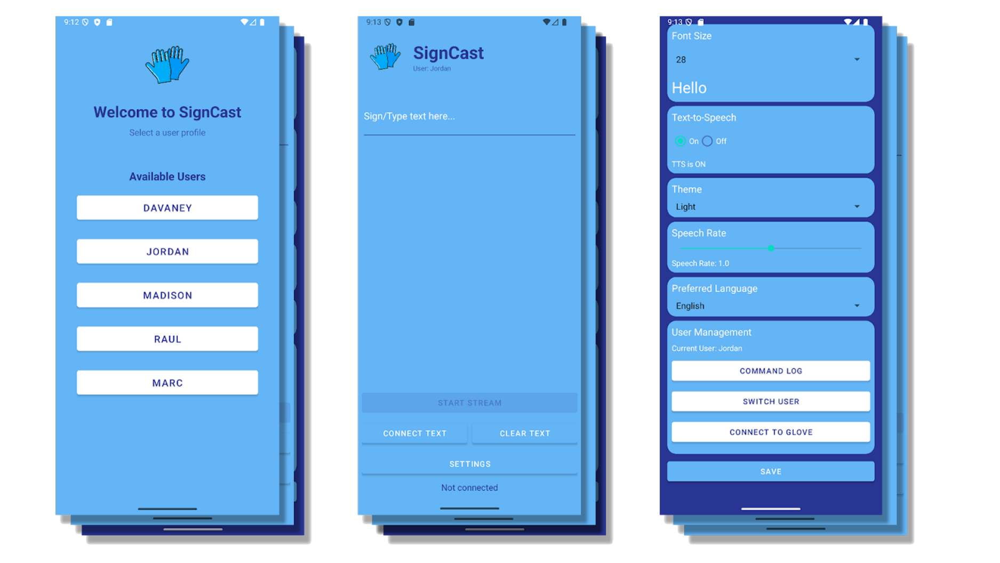
</p>


**Glove in Action**
<p align="center">
  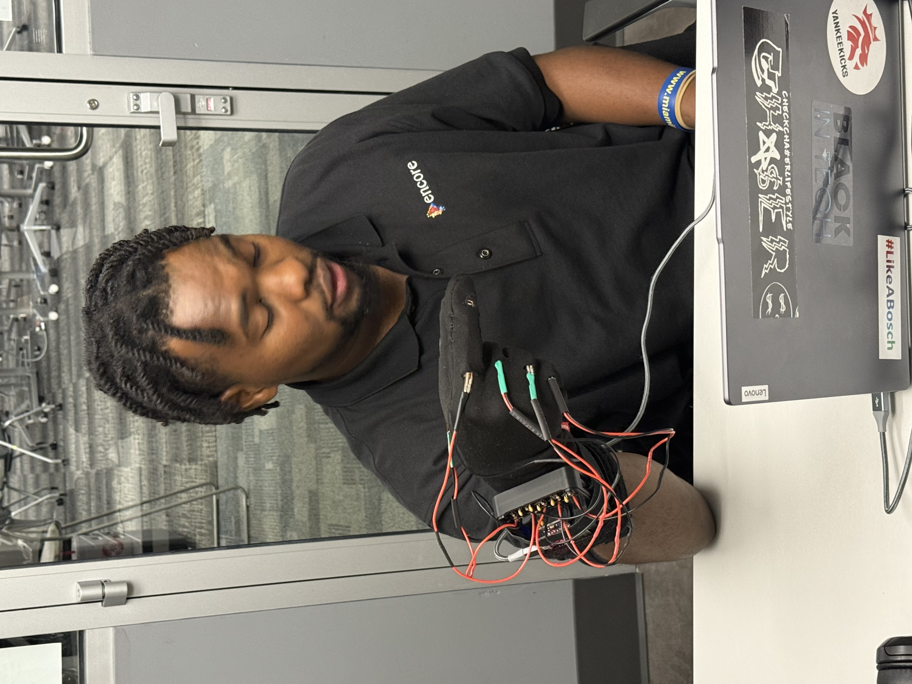
</p>

**Testing & Calibration**

<table>
  <tr>
    <td align="center" width="50%">
      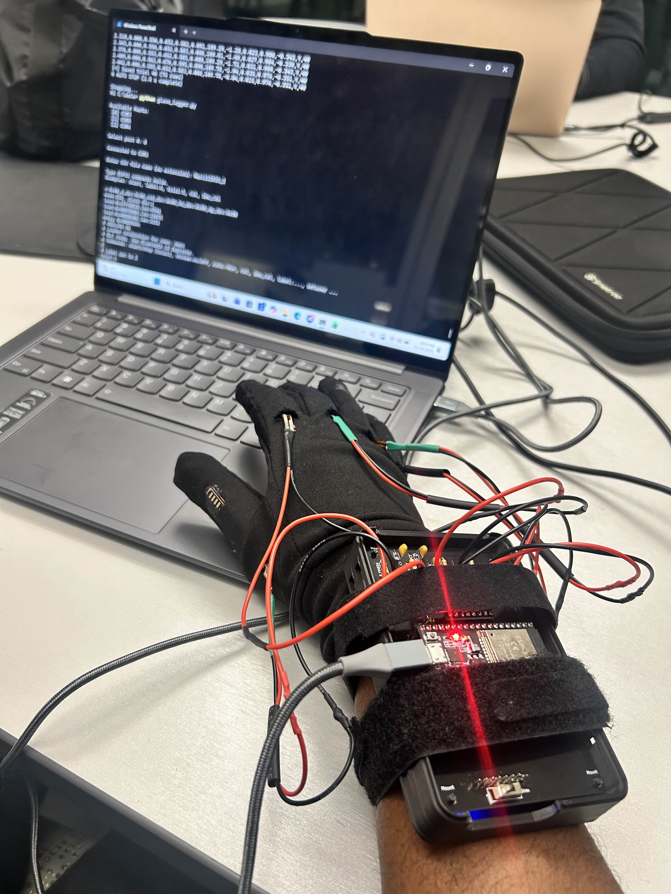
      <br><sub>Live sensor stream + calibration setup</sub>
    </td>
    <td align="center" width="50%">
      
      <br><sub>Gesture demo (GIF)</sub>
    </td>
  </tr>
</table>


---

## 🎯 System Overview

**Goal:** Translate ASL gestures using wearable sensors + embedded streaming + mobile ML inference.

### Pipeline Architecture

**How it works:**
1. **Glove sensors** (flex sensors + IMU) measure finger bend + motion
2. **ESP32 firmware** reads sensors and streams frames over Bluetooth
3. **Android app** receives frames, buffers a window, and runs on-device ML
4. App displays the predicted letter/gesture and can optionally do text-to-speech

#### System Architecture Diagram
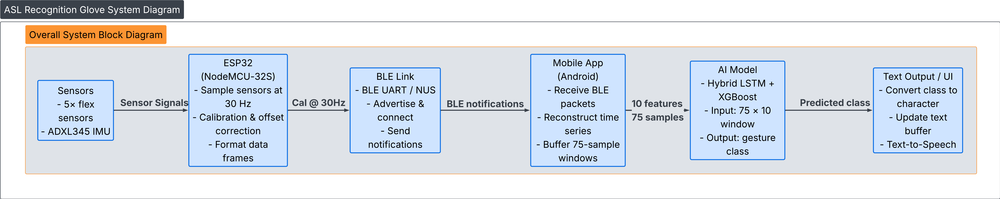

#### Data Flow Diagram
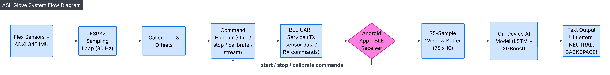

---

## 🔧 Hardware

### 📐 Circuit Schematics
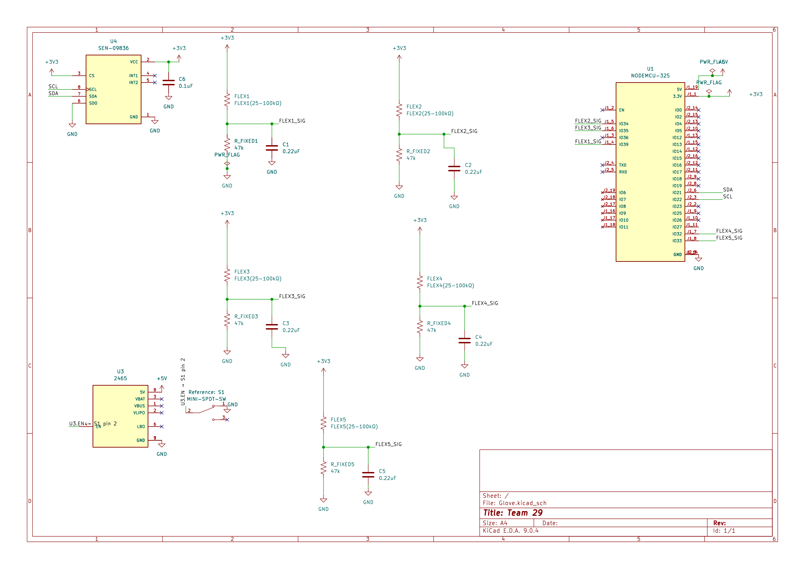

### 🖼️ PCB Design
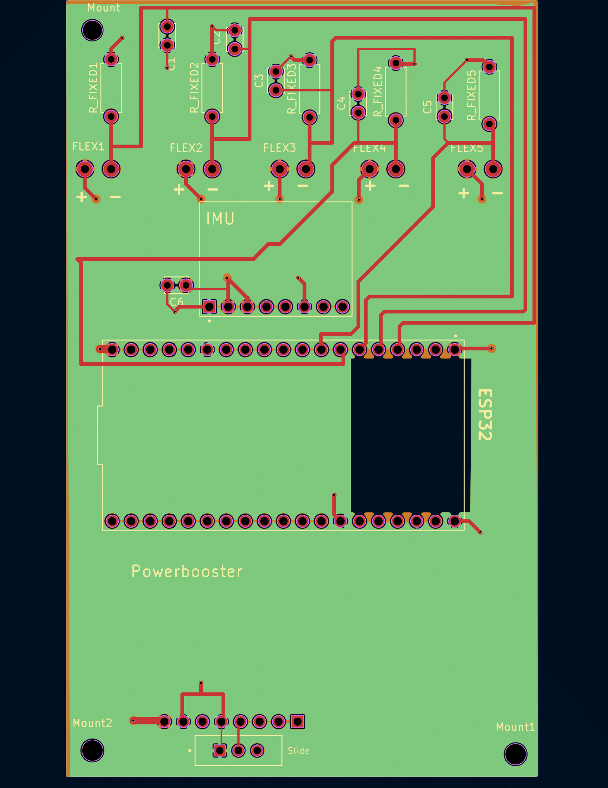

### 📋 Bill of Materials
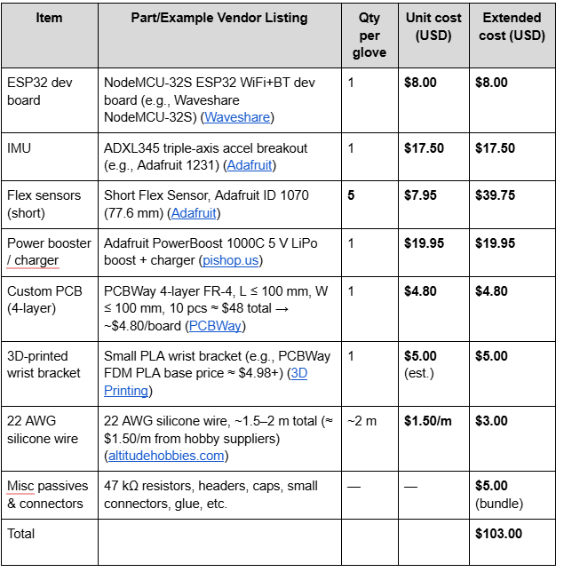

### 🔌 Wiring Guide

#### Wiring Diagram


#### Physical Wiring
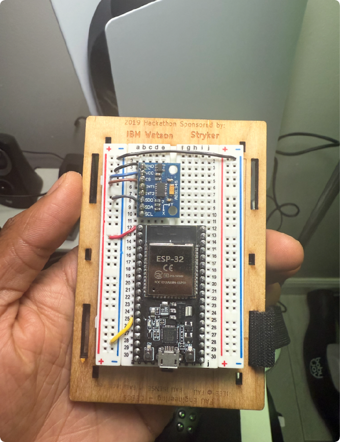

---

## 💻 Software Components

### 📱 Android App (Kotlin)

**Location:** [`android/`](android/)

**Purpose:** Connects to the glove over Bluetooth, streams sensor data, runs on-device inference, and displays the predicted ASL output.

**Features:**
- Bluetooth discovery/connection + live streaming
- Buffers a **75-sample window** and runs the **BiLSTM + XGBoost fusion** model
- Displays prediction (optional text-to-speech if enabled)
- Loads model assets from `android/app/src/main/assets/`

**Setup Instructions:**
1. Open **`android/`** in Android Studio (File → Open → `android`)
2. Place model files in `android/app/src/main/assets/`:
   - `TFLiteCompatible_LSTM.tflite`
   - `TFLiteCompatible_XGB.json`
   - `labels.txt` (optional)
3. Plug in Android phone → **Run**

> 📖 Detailed connection steps: [`docs/BLUETOOTH_SETUP_GUIDE.md`](docs/BLUETOOTH_SETUP_GUIDE.md)

---

### 🔷 ESP32 Firmware

**Location:** [`firmware/esp32/`](firmware/esp32/)

**Purpose:** Reads glove sensors and streams frames over Bluetooth at a steady rate.

**Features:**
- Reads flex sensors + IMU values
- Packages frames for the Android app
- Streams continuously over Bluetooth

**Setup Instructions:**
1. Open the main `.ino` in Arduino IDE
2. Select your ESP32 board + COM port
3. Upload

---

### 🛠️ Calibration Tools (Python)

**Location:** [`tools/`](tools/)

**Purpose:** Helps collect/replay calibration data and generate calibration outputs used by the Android app.

**Typical Use:**
- Capture baseline + max bend values
- Export calibration results to .csv for consistent readings across sessions/users

---

## 🤖 Fusion Model (AI + ML)

**Model Architecture:** Hybrid (stacked) LSTM + XGBoost
- LSTM learns sequence features from sensor windows
- XGBoost refines the prediction using LSTM residual/error information

**Model Specifications:**
- **Input window:** 75 samples × 10 features  
  `flex1–flex5, roll_deg, pitch_deg, ax_g, ay_g, az_g`
- **Output classes:** 28 total  
  `A–Z + NEUTRAL + BACKSPACE`
- **Label encoding:** `A→0 ... Z→25, BACKSPACE→26, NEUTRAL→27`

**Model File Locations:**
- `android/app/src/main/assets/`
  - `TFLiteCompatible_LSTM.tflite`
  - `TFLiteCompatible_XGB.json`
  - `labels.txt` (optional; one label per line in index order)


  <p align="center">
  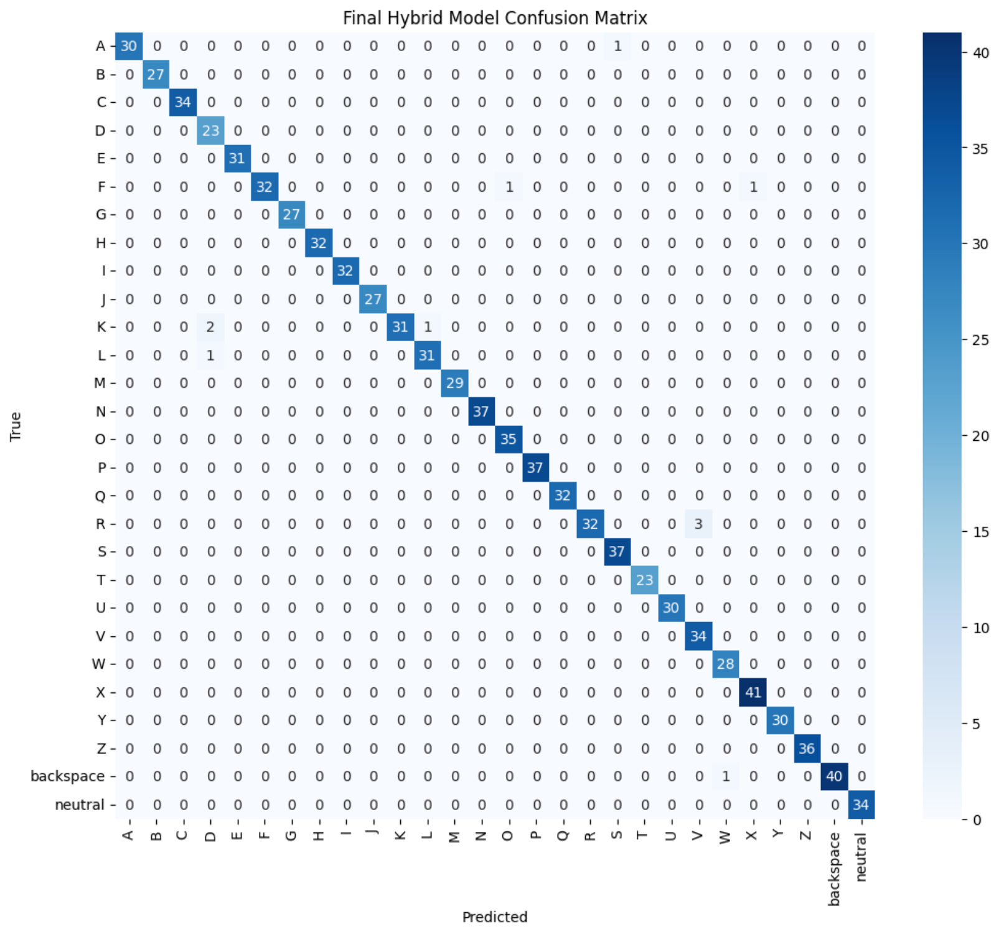
</p>

---

## 📁 Repository Structure

This repo is organized as a clean monorepo:

```
├── android/              # Android Studio project
├── firmware/esp32/       # ESP32 Arduino sketch
├── hardware/            # Schematics, PCB exports, build files
├── docs/                # BLE, calibration, setup documentation
└── tools/               # Python scripts and helper utilities
```

---

## 📚 Documentation

**Essential Guides:**
- 🔗 Bluetooth Setup: [`docs/BLUETOOTH_SETUP_GUIDE.md`](docs/BLUETOOTH_SETUP_GUIDE.md)
- 📡 BLE Commands: [`docs/BLE_COMMAND_GUIDE.md`](docs/BLE_COMMAND_GUIDE.md)
- ⚙️ Calibration: [`docs/CALIBRATION_SIMPLIFIED.md`](docs/CALIBRATION_SIMPLIFIED.md)

---

## 🚀 Roadmap

- [ ] Improve dataset collection flow (more users, more sessions, better labeling + balancing)
- [ ] Expand gesture vocabulary and add "confusable letter" training (ex: **M vs N**, S vs A, etc.)
- [ ] **Hardware v2:** add more sensing points (additional flex sensors / fingertip pressure / better IMU placement) to improve accuracy on close hand shapes
- [ ] Reduce latency + improve stability filtering (smoother predictions, fewer flickers)
- [ ] Enclosure + strain relief + durability improvements (wearability + repeatable sensor placement)
- [ ] **VR integration (long-term):** adapt the glove as a VR input device (pose/gesture tracking + SDK integration)

---

## 👥 Credits

**Team Members:**
- Jordan Wray
- Madison Peterkin
- Raul Chavez
- Davaney Pierre
- Mark Louis

**Institution:** Engineering Design 2, Florida Atlantic University

**Acknowledgments:** Inspired by Cornell University ECE 4760 "Sign Language Translation" glove projects (sensor glove + ML translation concept)

---

<p align="center"><b>Made with ❤️ by the SignCast Team</b></p>

<p align="center">
  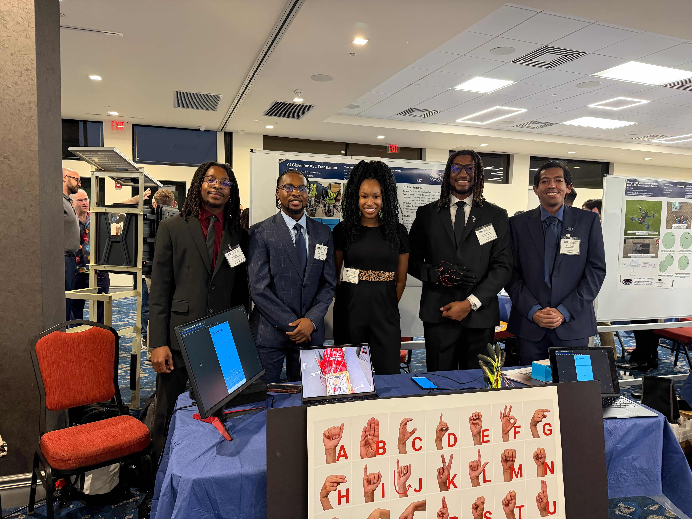
  <br>
  <sub>Engineering Design 2 — SignCast Team (5 members)</sub>
</p>